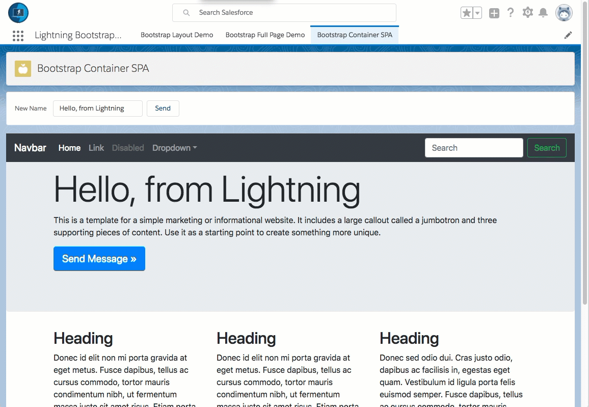
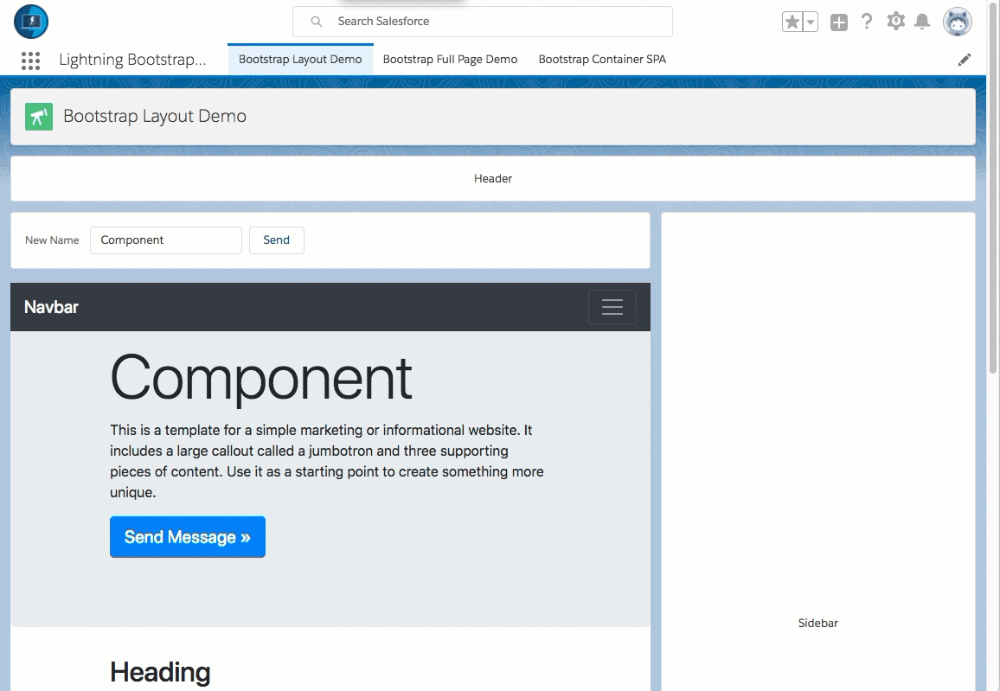

# Overview

This is a quick example of how to run Bootstrap within Lightning Experience.
(similar ideas work for angular, react, etc)

**Please note: sample code (metadata api and dx formats) are available in the [mdapi](./mdapi) and [dx](./dx) folders above**

... why you should not always do this.

# Demo

In this case, we have a Lightning Component with Bootstrap running within a Lightning App Builder page.

**Note: although it is possible to use [ltng:require](https://developer.salesforce.com/docs/atlas.en-us.lightning.meta/lightning/aura_compref_ltng_require.htm) to embed external resources, this will not pass security reviews.  As such, we will focus only on [lightning:container](https://developer.salesforce.com/docs/atlas.en-us.lightning.meta/lightning/aura_compref_lightning_container.htm) for this demo.**

**You can see an example using [ltng:require here](dx/force-app/main/default/aura/ltng_BootstrapComponent)**

.

.

.

Alternatively, it makes very little difference where this component lives,
as it can live comfortably with other lightning components

.

.

.

Conversely, it is possible to have Bootstrap running in a Visualforce page,
as this already has it contained within a security frame.

(messages can be sent back and forth to lightning using [Window.postMessage()](https://developer.mozilla.org/en-US/docs/Web/API/Window/postMessage) )

.

.

.

# TLDR How

**Generate a single page web app, and upload within a static resource zip**

[Such as this silly little example](dx/force-app/main/default/staticresources/ltng_support_bootstrap_4_1_0/index.html)

Bootstrap was chosen because it is fairly easy to understand  
and the same process works with angular, react, vue, other frameworks.

**Use a Lightning Container with an html single page web app**

	

        <lightning:container aura:id="bootstrapApp"
            src="{!$Resource.ltng_bootstrap_4_1_0 + '/index.html?helloName=' + v.helloName}"
            onmessage="{!c.handleMessage}"
            onerror="{!c.handleError}"
        />
    

    
**If you want to send messages from SPA to lightning, include the lightning-container npm module**

[Lightning-Container npm module](https://www.npmjs.com/package/lightning-container)

Then make calls to send the message using the module.

    //-- sent from the lightning-container/lightning-container.js module
    moduleReference.sendMessage({
        name : 'HiBack',
        value : someValue
    });
    
and within the lightning component, include the `onmessage="{!c.handleMessage}"` attribute in the lightning:container

    /**
     * Handles message sent from bootstrap application
     **/
    handleMessage : function(component, message, helper){
        console.info('lightning received message');
        var payload = message.getParams().payload;
        if (payload.name === "HiBack"){
            var value = payload.value;
            var toastEvent = $A.get("e.force:showToast");
            toastEvent.setParams({
                "title": "Hi Back",
                "message": value + " says: 'Hi Back'"
            });
            toastEvent.fire();
        } else {
            console.error('unknown message sent from bootstrap');
        }
    },
    
**If you want to send messages from Lightning to SPA, include the lightning-container npm module**

[Lightning-Container npm module](https://www.npmjs.com/package/lightning-container)

Send the `component.find("yourcontainerAuraId").message()`

    /**
     * Sends a message to the bootstrap application
     **/
    sendMessage : function(component, event, helper){
        console.info('sendMessage');
        var helloName = component.get('v.helloName');
        var msg = {
            name: "General",
            value: helloName
        };
        component.find('bootstrapApp').message(msg);
    },

And within your SPA, receive the message

	/**
	 * Handles the message from the lightning component
	 * @param {*} message - same as sent from lightning component
	 */
	window.addMessageHandler( function(message){
	    console.info('message received');
	    var valueSent = message.value;
	    ...
	});

---

# Demo code overview

The metadata for this example can be found under the [mdapi](./mdapi) folder.

The Salesforce CLI version of this code can be found under the [dx](./dx) folder.

This can also be installed using Unlocked Packages (previously known as Developer Controlled Packages) in sandboxes using this url:

[url](url)

## Installing via the Salesforce CLI

This assumes you have already installed the [Salesforce CLI]() and [Connected the Salesforce CLI to your org](https://developer.salesforce.com/docs/atlas.en-us.sfdx_dev.meta/sfdx_dev/sfdx_dev_auth_web_flow.htm).

However, the Salesforce CLI can be used with any org and does not require Salesforce DX to be enabled. (Although enabling the DX / Dev Hub would give some great benefits, and would only require care of [certain object permissions: Scratch Org Info, ActiveScratchOrg, NamespaceRegistry](https://developer.salesforce.com/docs/atlas.en-us.sfdx_setup.meta/sfdx_setup/sfdx_setup_add_users.htm) - as they are not available in all orgs)

**1.** Run the following command:

	sfdx force:mdapi:deploy -d mdapi -u [[orgAlias]] -w

**2.** Add the permission set to your user

	sfdx force:user:permset:assign -n Ticket_Manager -u [[orgAlias]]
	
**3.** Upload the data

	sfdx force:data:tree:import -f data/tree/Ticket__c.json -u [[orgAlias]]
	
...

Thats it, you can now open the org, and find the 'ticket' object in the 'all tabs' search.

	sfdx force:org:open -u [[orgAlias]]

	
